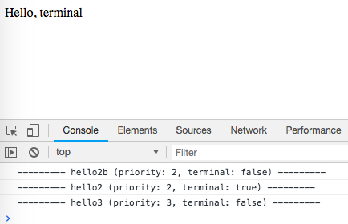

AngularJS1 Directive Terminal Demo
==================================

如果一个directive的`terminal:true`，则作用于同一个Element上的其它的`priority`小于该directive的directive不会被执行。

```
npm install
open index.html
```



TODO
----

虽然当前Demo演示了directive的运行过程，但是我还没有想到一个合适的例子来解释在什么情况下，我们应该使用`terminal`

Resources
---------

- directive `terminal` api: <https://docs.angularjs.org/api/ng/service/$compile#-terminal->